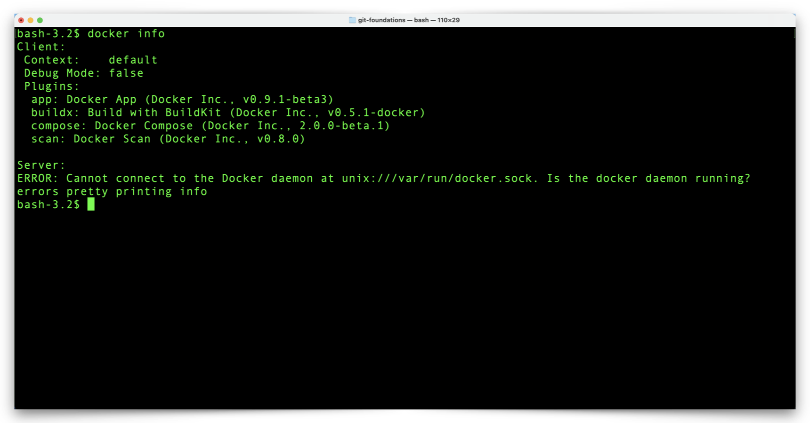
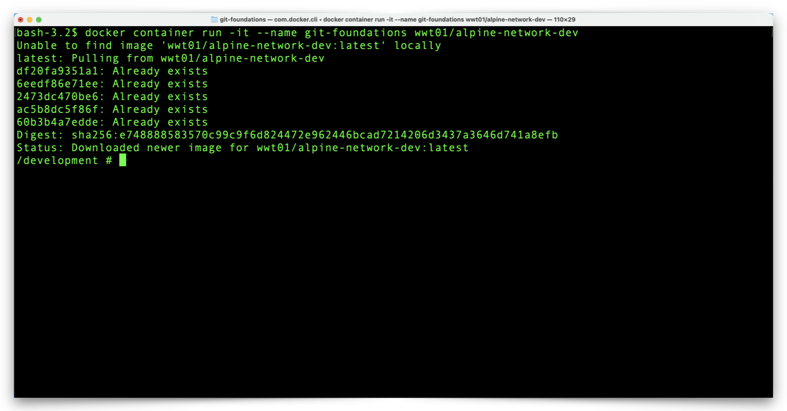

# Hands-On Environment Setup

A WWT-built Docker Image provides a ready-to-use environment for the Git hands-on exercises. The Docker Container already has Git software installed and you don't need any Docker experience for these exercises. Just make sure you have [Docker Desktop](https://www.docker.com/products/docker-desktop "Docker Desktop Download") installed and running on your Windows or macOS computer and we will walk you through the development environment setup.

!!! note
    :warning: You can use your terminal/shell program to confirm your Docker environment is ready for use with the following command:

```shell
docker info
```

:clap: If your output looks something like this, you are all set:


---

:exclamation: If you see an error message similiar to the examples below, make sure you installed Docker Desktop and that Docker Desktop is running.  You may also review the [Docker Desktop Installation Documentation](https://docs.docker.com/desktop/ "Docker Desktop Installation Documentation").



---

There are two-steps in the process (download and then run) to create the Docker Container we need from the WWT-built Docker Image, but we will accomplish both steps with a single command.

1. Open your terminal/shell program (iTerm, PowerShell, Bash, etc.) and enter the following command:

```shell
docker container run -it --name git-foundations wwt01/alpine-network-dev
```

This command performs the following actions:

- Downloads the 'wwt01/alpine-network-dev' Image from [Docker Hub](https://hub.docker.com/r/wwt01/alpine-network-dev "WWT Development Docker Image on Docker Hub").
- Creates a Docker Container with the name 'git-foundations'.
- Attaches to the terminal of the 'git-foundations' Container.

Expect the first run of this command to take a few minutes, while Docker Desktop downloads the Image from Docker Hub. Docker Desktop stores the Image on your computer, so subsequent runs of this command will only take a split second.

You will know your Docker Container environment is ready for the Git hands-on exercises when your terminal prompt changes to `/development#`:



---

2. If you aren't sure whether you are at your computer's terminal prompt or the prompt within the Docker Container, you can use this command to check:

:bulb: **Note: The Container will ignore any commands/lines that begin with the `#` character, treating those lines as inline comments.  Throughout the walkthrough documentation, you may copy entire blocks of commands and paste them in the Container terminal.  These purpose of these comment lines is to explain specifically what the subsequent commands do.**

```shell
# Display the contents of the Container operating system release file 
cat /etc/*-release
```

3. You are in the Docker Container environment if your output looks like this:


---

4. Check the version of Git in the environment with the following command:

```shell
git --version
```

The result of that command should look something like this:


---

Here is a quick reference for some other Docker commands which will help you manage your Git hands-on environment:

:bulb: **Note: Run these commands from your local terminal shell (Windows PowerShell, macOS Terminal, etc.) and not from within the Docker container shell.**

```shell
control + d (key sequence) # Stops your Container and returns you to your terminal prompt
docker container start git-foundations # Restarts your Container in the background
docker container attach git-foundations # Returns you to the Container prompt
docker container rm git-foundations # Destroys your container so you can start over
```

---

Your environment is set up and ready to use! Not to painful so far, right? Click the link below to get started with Git:

[Next Section > Setup GitHub Authentication](section_2.md "Setup GitHub Authentication")
