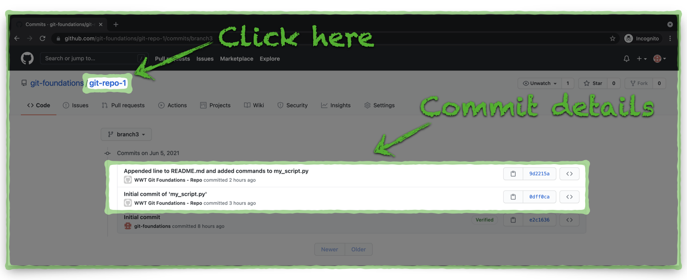

# Review Changes in the GitHub Repository

Let's take a look at how the changes we pushed from our local Git repository impact the GitHub repository.

---

## Local Repository Push Review

1. Return to [GitHub](https://github.com "GitHub.com"){target=_blank} and notice a few things about the repository:
    - There is still just one commit on the **main** branch; we haven't yet _merged_ the changes in **branch3** to the **main** branch.
    - The GitHub repository now has three branches, up from two before we pushed **branch3** from our local Git repository to GitHub.
    - There is a highlighted message indicating a recently pushed branch (**branch3**).

    {target=_blank}

    ---

2. Expand the **Branch: main** drop menu and notice there three branches, **main**, **branch1**, and **branch3**.

3. Click on **branch3**:

    {target=_blank}

    ---

4. From the **branch3** view, notice GitHub shows us that **branch3** is two commits ahead of the **main** branch.
    - These two commits represent the two commits we made to our local repository and then pushed to GitHub.

5. Click on the **3 commits** link to review the individual commits.

    {target=_blank}

    ---

6. The **branch3** commits view shows three total commits.
    - One of the commits is the initial commit that occurred when we created the repository.
    - We can also see the two atomic commits from our local Git repository along with the messages we added with the `git commit -m` commands.
    - Even though the `git push` command sent all of our local repository to GitHub at once, the individual atomic commits remain separate and reviewable.

    {target=_blank}

7. Click the **git-repo-1** link at the top of the window to return to the repository home page.

---

Now we can start the process to merge our local changes to the GitHub repository, from **branch3**, into the **main** branch. Click the link below to continue:

[Next Section > Pull/Merge Changes in GitHub](section_11.md "Pull/Merge Changes in GitHub")
