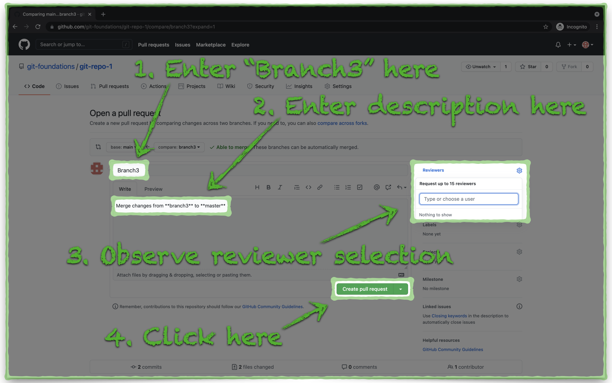
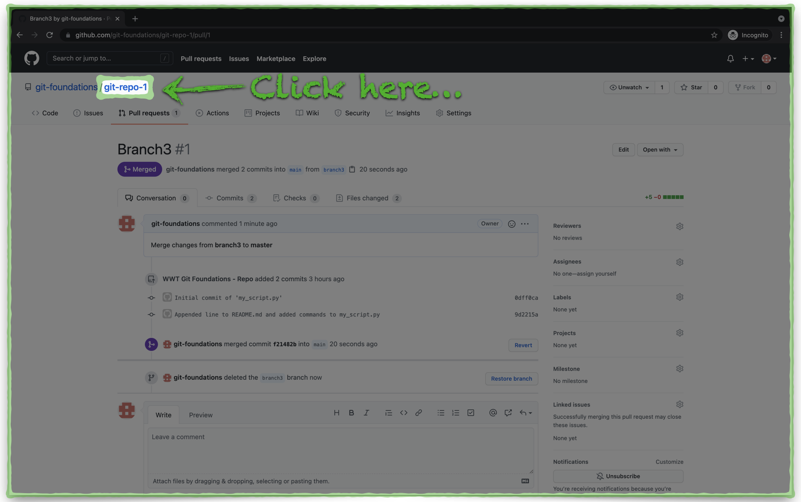

# Pull/Merge Changes in GitHub

A **pull request** is GitHub's terminology for starting the process to merge changes from one branch into another. In this example, we will merge changes from **branch3** into **main**, effectively updating the mainline copy of our repository.

---

## Create a Pull Request

1. Locate and click the green **Compare & pull request** button:

2. Add the following details to the **pull request**:
   - **Title - _Branch3_**
   - **Comment - Merge of changes from \*\* branch3\*\* to \*\*main\*\***
   - Add your own GitHub account to the **Reviewers** list.
     - Typically, you would not assign a pull request review to yourself. Instead, you would assign the pull request to a peer, for a review by a second set of eyes. For the purpose of this walkthrough, it's okay to assign yourself as the reviewer.
3. Click the green **Create pull request** button:

---

## Merge the Pull Request

1. Since you are the assignee for this **pull request**, you get the opportunity to review all the commits.
2. Review the details of the **pull request** and click the green **Merge pull request** button:

---

GitHub gives you one more prompt to confirm the merge action — click the green **Confirm merge** button to complete the **pull request**.

---

## Remove Branch3 from GitHub

1. Just in case you didn't confirm the merge action enough already, GitHub gives you the option to revert the operation. For the purpose of this walkthrough, we can skip this step.
2. In some cases, you may want to retain branches after you merge their changes into **main** or any other branch. In this case, we will remove **branch3** to keep from cluttering the repository with a history of all branches. Click the **Delete branch** button to remove **branch3** from GitHub.

---

2. Click the **git-repo-1** link at the top of the window to return to the repository home page.

---

3. Notice the message which indicates the merge of the **pull request**.

We are just about done. Next up, we will look at how the merge of the **pull request** in GitHub impacts our local Git repository. Click the link below to continue:

[Next Section > Review The Pull Request Impact to Your Local Git Repository](section_12.md "Review The Pull Request Impact to Your Local Git Repository")
