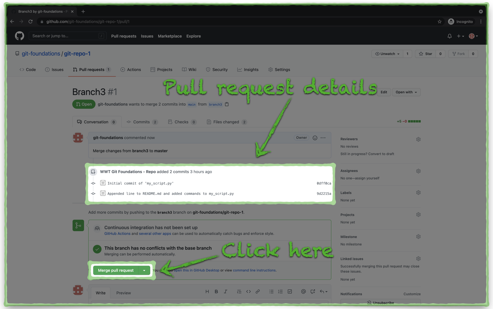
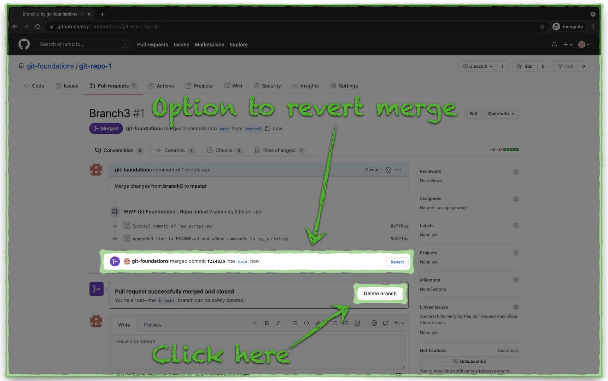

# Pull/Merge Changes in GitHub

A **pull request** is GitHub's terminology for starting the process to merge changes from one branch into another. In this example, we will merge changes from **branch3** into **main**, effectively updating the mainline version of the files in the GitHub repository.

---

## Create a Pull Request

1. Locate and click the green **Compare & pull request** button:

    {target=_blank}

2. Add the following details to the **pull request**:
    - **Title - _Branch3_**
    - **Comment - Merge of changes from \*\* branch3\*\* to \*\*main\*\***
    - Click on the the **Reviewers** list.
        - Typically, you would assign at least one reviewer to a **pull request**. This allows yout to ask a peer to put a second set of eyes on your changes before a merge occurrs.
        - GitHub does not allow you to assign your own GitHub account as a reviewer of a **pull request** that you create. For this exercise, you don't need to enter anything in the **Reviewers** list.

3. Click the green **Create pull request** button:

    {target=_blank}

---

## Merge the Pull Request

1. Review the details of the **pull request** and then click the green **Merge pull request** button:

    {target=_blank}

    ---

2. GitHub gives you one more prompt to confirm the **merge** action.

3. Click the green **Confirm merge** button to complete the **pull request**.

    {target=_blank}

---

## Remove Branch3 from GitHub

1. Just in case you didn't confirm the merge action enough already, GitHub gives you the option to revert the operation. For the purpose of this walkthrough, we can skip this step.

2. In some cases, you may want to retain branches after you merge their changes into the **main** branch, or any other branch. In this case, we will remove **branch3** to keep from cluttering the repository with a history of every branch. Click the **Delete branch** button to remove **branch3** from GitHub.

    {target=_blank}

    ---

3. Click the **git-repo-1** link at the top of the window to return to the repository home page.

    {target=_blank}

    ---

4. Notice the message which indicates the merge of the **pull request**.

    {target=_blank}

---

We are just about done. Next up, we will look at how the **merge** of the **pull request** in GitHub impacts our local Git repository. Click the link below to continue:

[Next Section > Review The Pull Request Impact to Your Local Git Repository](section_12.md "Review The Pull Request Impact to Your Local Git Repository")
