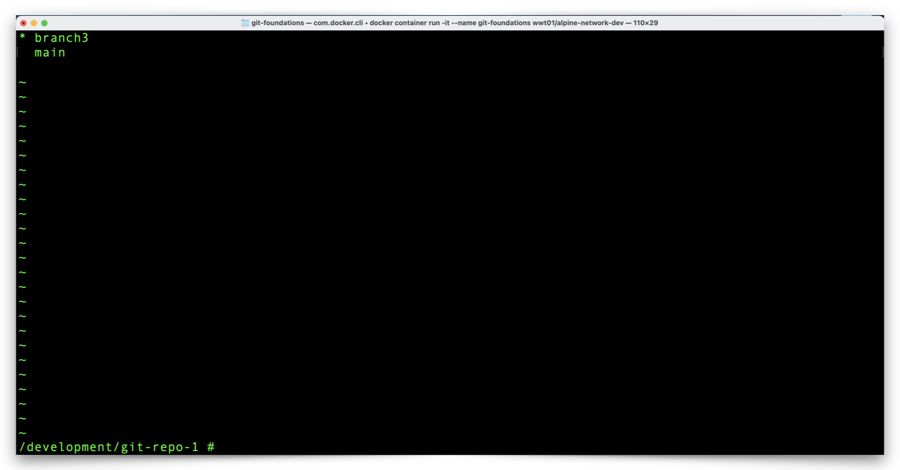
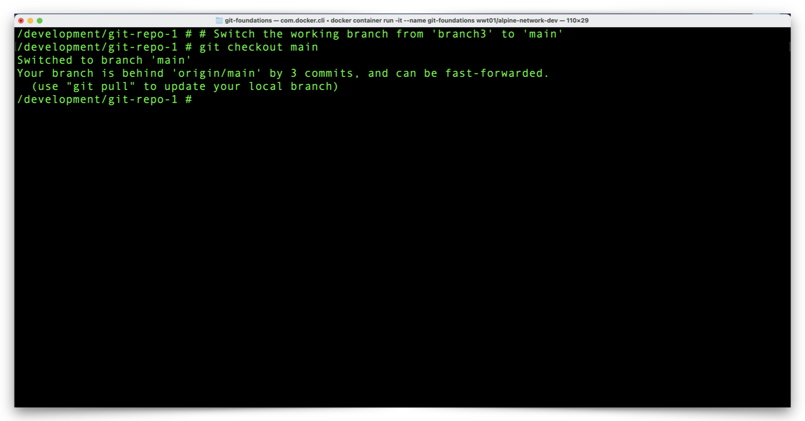
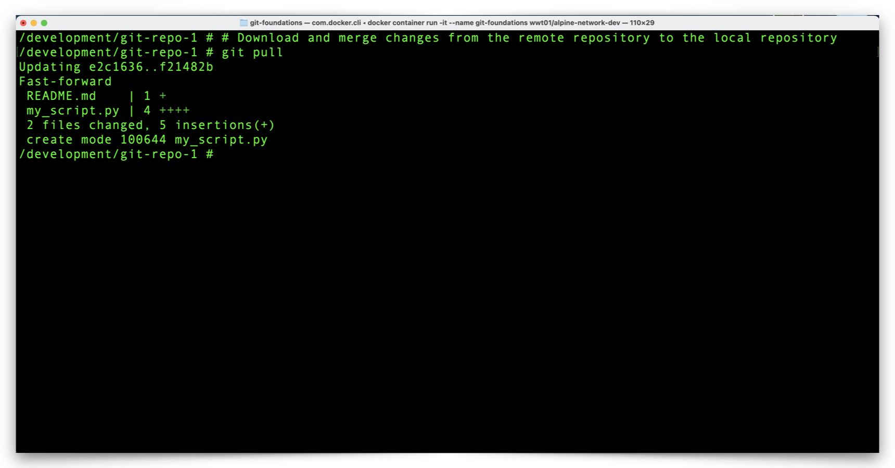

# Review The Pull Request Impact to Your Local Git Repository

The GitHub repository has a new version of the **main** branch but the **main** branch in our local repository isn't aware of the changes yet (only our local **branch3** branch is aware of the changes). Before we make new changes to our local GIt repository, let's get it in sync with GitHub and clean up the branch (**branch3**) which is no longer in GitHub.

---

## Pull Changes from GitHub

1. From the Docker Container terminal, attempt to **pull** (download/fetch and merge) the latest changes from GitHub to your local repository with the following command:

    ```shell
    # Download and merge changes from the remote repository to the local repository
    git pull
    ```

    [](/git-foundations/images/git-pull-branch3.png){target=_blank}

2. Notice the last two lines of the output which indicate Git attempted to pull changes from GitHub and merge those changes with **branch3** in the local Git repository.

    - However, the local Git repository was unable to locate **branch3** in GitHub because, of course, we deleted **branch3** in GitHub after merging our **pull request**.

    ---

3. List your local branches with the following command:

    ```shell
    # Display all local git branches
    git branch
    ```

    [](/git-foundations/images/git-branch-6.png){target=_blank}

4. Notice **branch3** remains in your local repository and is the current, working branch.

    ---

5. Change your working branch to **main** with the following command:

    ```shell
    # Switch the working branch from 'branch3' to 'main'
    git checkout main
    ```

    [](/git-foundations/images/git-checkout-main.png){target=_blank}

6. Notice the message which indicates the local Git repository branch **main** is behind the GitHub **main** branch (**origin/main**) by three commits and can be fast-forwarded (synchronized with the latest changes).

    ---

7. Download and merge the GitHub **main** branch with your local Git repository **main** branch using the following command:

    ```shell
    # Download and merge changes from the remote repository to the local repository
    git pull
    ```

    [](/git-foundations/images/git-pull-main.png){target=_blank}

8. Notice the output which indicates the file changes and insertions.

    ---

9. Since our local Git repository **main** branch now in sync with the latest copy of the GitHub repository **main** branch, we no longer need our local copy of **branch3**. Remove **branch3** from the local repository with the following command:

    ```shell
    # Delete the local branch named 'branch3'
    git branch -d branch3
    ```

    [](/git-foundations/images/git-branch-d-branch3.png){target=_blank}

    ---

10. Confirm **branch3** no longer exists in the local Git repository with the following command:

    ```shell
    # Display all local git branches
    git branch
    ```

    [](/git-foundations/images/git-branch-7.png){target=_blank}

11. Notice that **main** is now the only branch in your local Git repository.

---

:star: You did it! You:

- [x] Set up a new GitHub repository.

- [x] Set up a local Git environment in a Docker Container.

- [x] Managed local Git repository branches.

- [x] Staged and committed local Git repository changes.

- [x] Pushed branches and changes from your local Git environment to GitHub.

- [x] Merged changes in GitHub with a pull request.

- [x] Synchronized merged GitHub changes to your local Git environment.

---

Click the link below to go to the last section and finish things up:

[Next Section > Clone Another Repository, Make Changes, and Create a New Pull Request](section_13.md "Clone Another Repository, Make Changes, and Create a New Pull Request")
