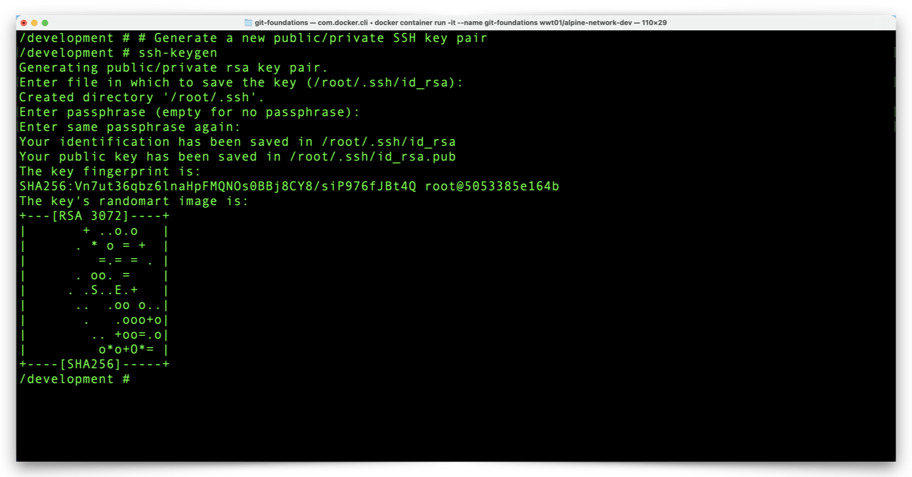

# Setup GitHub Authentication

## GitHub Version Control Overview

Git is a distributed Version Control System (VCS) which means any copy of any Git repository can function independently of any other copies of the same Git repository. A Git repository can reside on any single computer, Container, etc. and there are also hosted or managed Git solutions which provide a central location to aggregate changes to version-controlled files.

[GitHub](https://github.com "GitHub.com") is one example of a hosted or managed Git solution.  These hosted/managed solutions allow many people to run local instances of Git software on their computers and keep their version-controlled files, source code, documentation, etc. in sync with one another.

- This remainder of this walkthrough will show you how to:
  - Create a centralized Git repository on GitHub.
  - Synchronize the GitHub repository with our local Git environment (the 'git-foundations' Docker Container).
  - Make changes to the local Git repository.
  - Merge local Git repository changes to GitHub.

---

## GitHub Authentication Overview

Before we setup a GitHub repository, it's a good idea to consider how our local Git environment (the 'git-foundations' Container) will authenticate to GitHub during repository synchronization events (clone, pull, push, etc). GitHub supports two types of secure transport, each with their own authentication mechanism(s):

1. HTTPS with basic authentication (username and password) or API key.
2. SSH with public/private key authentication.

Either choice is just as good as the other. In this environment, we use SSH because it allows us to secure communication without having to manage credentials or API keys. We will set up SSH authentication before we create a GitHub repository.

---

## Generate an SSH Key Pair

1. From the Docker Container prompt, generate an SSH key pair with the following command:

```shell
# Generate a new public/private SSH key pair
ssh-keygen
```

2. After you enter this command and press your Return/Enter key, you may press your Return/Enter **three more times**, to accept the default storage location for the key and to accept and confirm the default, blank passphrase. Your terminal output will look something like this:



---

3. Display the new SSH public key file in the terminal with this command:

```shell
# Displays the contents of the new SSH public key file
cat ~/.ssh/id_rsa.pub
```

:exclamation: **Note: Treat your SSH keys as if they were any other form of credentials and do not share them with anyone.**


4. Copy the full contents of the SSH public key output to your clipboard, including the **ssh-rsa** at the beginning of the file and the **root@_container_id_** at the end of the file. We will share the text from this file with GitHub to establish mutual trust between our Container and GitHub.

---

## Setup GitHub SSH Key Authentication

1. Navigate to [https://github.com/login](https://github.com/login "GitHub Login"), log in, click the **Profile** icon in the upper-right corner of the window, and choose **Settings**.


---

2. Click on the **SSH and GPG keys** tab on the left side of the window.


---

3. Click the green, **New SSH key** button


---

4. Provide a title for the SSH key (any title you like is just fine), paste the SSH key file text from your Container into the **Key** field, and click the green, **Add SSH key** button.


---

5. Confirm that GitHub now has a copy of your container's SSH public key.


---

SSH authentication setup is complete and we are ready to create a new GitHub repository. Click the link below to continue:

[Next Section > Create a GitHub Repository](section_3.md "Create a GitHub Repository")
