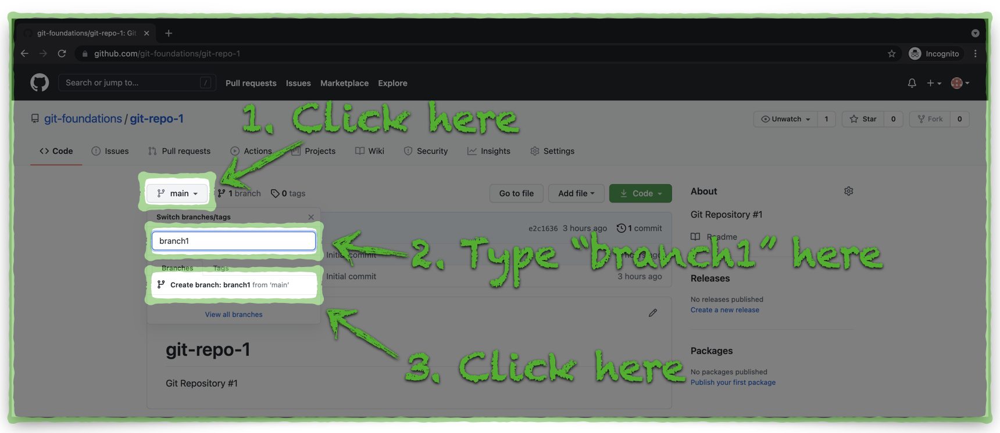
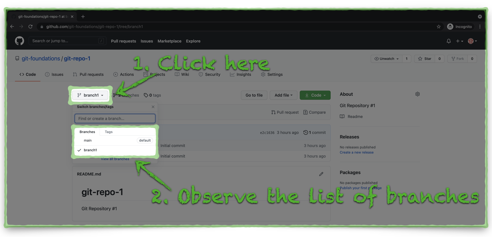

# Create a New Branch in a GitHub Repository

It is common for several people to work on the code or contents within a GitHub repository at the same time. Each person can work within their own branch, an isolated copy of the repository code, so their changes don't accidentally step on each other.

Before we clone our new repository to our Docker Container, let's create a new branch from the default, **main** branch to simulate the scenario that someone else already started working on changes to the repository within their own branch.

```
!!! note
    :bulb: It is more common and generally a best practice to create new branches within local development environments and then to push those branches to GitHub. This step illustrates a point which we will review in a subsequent section.
```

1. Click the **Branch: main** button to expand the **Branch** drop-down menu. Type the name **branch1** for the new branch and then click the text **Create branch: branch1 from 'main'**.



---

2. Click the **Branch: branch1** button to expand the **Branch** drop-down menu and notice there are now two branches, **main** and **branch1**.



It's time to get a copy of our GitHub repository to our Docker environment. Click the link below to continue:

[Next Section > Clone a GitHub Repository to Your Computer](section_5.md "Clone a GitHub Repository to Your Computer")
