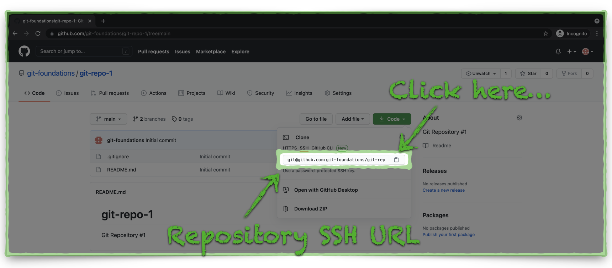
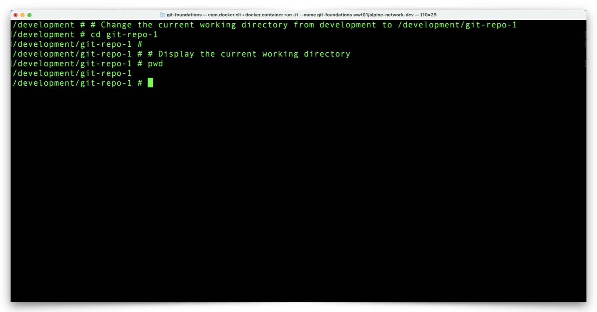
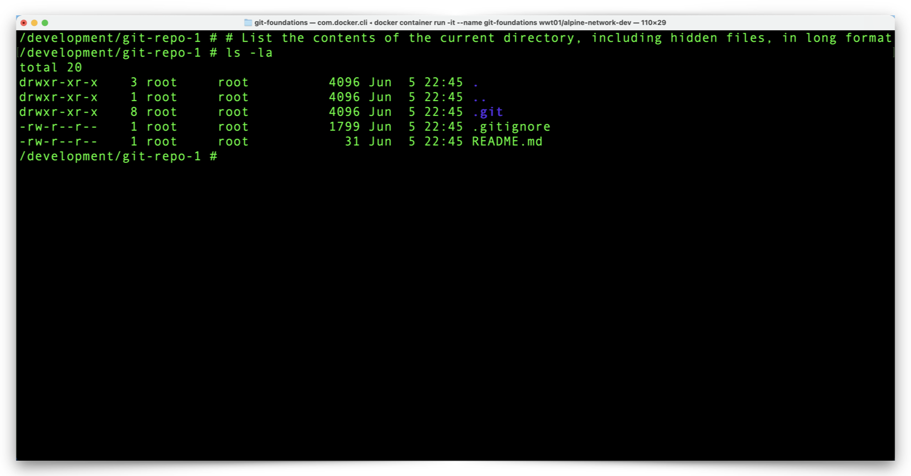

# Clone a GitHub Repository to Your Computer

Now it's time for us to work with our GitHub repository, and we start by copying or **cloning** the repository to our local Docker Container environment.

---

## Copy The Repository SSH URL

We mentioned GitHub supports two transports, HTTPS and SSH. GitHub defaults to HTTPS transport which adds an extra step (entering your username and password) to the cloning process.  The SSH keys we setup in [Section 2](section_2.md "Setup GitHub Authentication") allows our Docker Container and GitHub to communicate with each other without repeatedly prompting for credentials.

1. Click the green **Clone** button and notice that GitHub displays an HTTPS URL. Click the **SSH** link to change the display to an SSH URL.


---

2. Click the **Copy** icon, just to the right of the SSH URL, to store the URL on your clipboard.



---

## Clone & Review The Repository

1. From the Docker Container prompt, type the command `git clone` and then paste **_your repository URL_** as in this **_example_** (your repository URL will be different than in the example below):

```shell
# Download a new copy of a GitHub repository to a local system (our Container, in this case)
git clone git@github.com:your-repository-url/git-repo-1.git
```

```
!!! note
    :warning: You will likely see a prompt which asks you to confirm the authenticity of GitHub's SSH RSA fingerprint. You may safely type `yes` and press Return/Enter to continue.
```

The result of that command should look something like this:


---

2. List your directory contents to view your repository folder, **git-repo-1**, with the following command:

```shell
# List the contents of the current directory in long format
ls -l
```


---

3. Change to your repository directory and display your current working directory with the following commands:

```shell
# Change the current working directory from development to /development/git-repo-1
cd git-repo-1
```

```shell
# Display the current working directory
pwd
```



---

4. Let's take a quick look at the contents of your repository directory, including the hidden files, with the following command.

```shell
# List the contents of the current directory, including hidden files, in long format
ls -la
```



5. Notice that both of the files in your GitHub repository (**.gitignore** and **README.md**) are now in our Docker Container.

---

6. View the contents of the **README.md** file with the following command:

```shell
# Display the contents of the file 'README.md'
cat README.md
```


---

6. There is one item in our repository directory which isn't in our GitHub repository, the **.git** directory. This directory contains all the details about your local repository and you should rarely, if ever, have to interact with these files. Just to see what the contents of this folder look like, use the following command:

```shell
# List the contents of the .git directory in long format
ls -l .git
```


We now have a copy of our GitHub repo in our Docker environment. Before we make changes to our local copy of the repository, we need to configure a few local Git settings. Click the link below to continue:

[Next Section > View & Configure Local Git Settings on Your Computer](section_6.md "View & Configure Local Git Settings on Your Computer")
