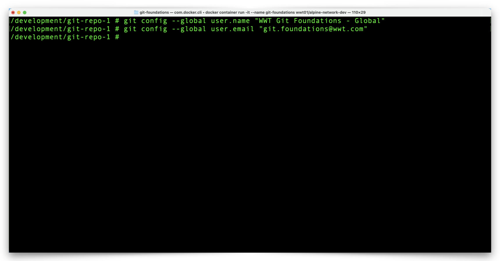
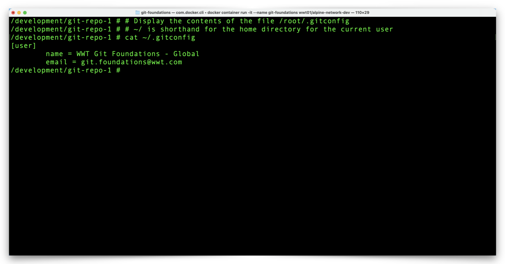
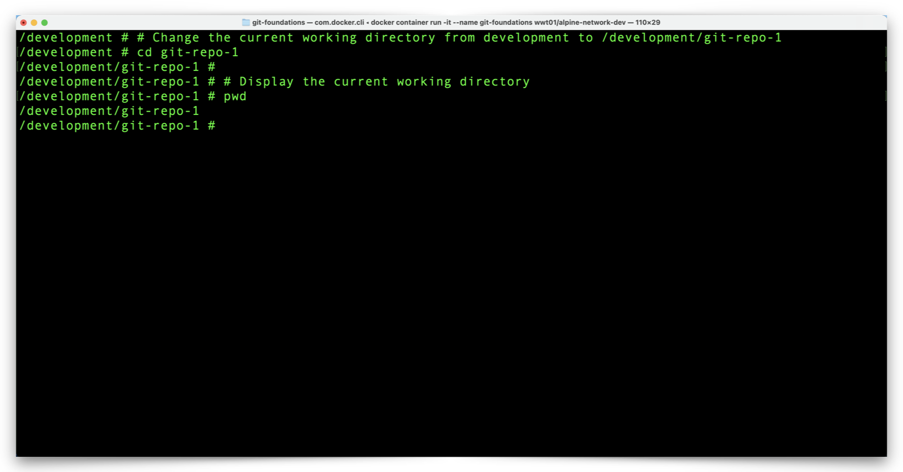

# View & Configure the Local Git Settings in your Docker Container

Git requires very little information before we can start to make local repository changes and then push those changes to GitHub. We just need to tell Git the **name** and **email address** of the person contributing changes, as a way to help all repository viewers and contributors understand who contributes what. We provide Git with our **name** and **email address** using one or more configuration files.

Git has several tiers of configuration files, and we will explore the three most common:

- **System-wide** — **_/etc/gitconfig_**

    - Applies to all repositories for _all_ users on a system.

- **Global** — **_~/.gitconfig_**

    - Applies to all repositories for a _single_ user on a system.
    - Supersedes any overlapping **system-wide** settings.

- **Local repository** — **_repository_folder/.git/config_**

    - Applies to a single repository.
    - Supersedes any overlapping **global** and **system-wide** settings.

---

## Git Name & Email Address Configuration

It is most typical for people to add their **name** and **email address** to their **global** configuration settings, thereby making it possible to perform Git operations on any repository within their user profile. If a few Git repositories within a user profile require a different **name** or **email address** combination, it is typical to set those at the **local repository** level, on a case-by-case basis.

For the purpose of familiarization with the process to configure different Git configuration files, we will configure our Docker environment in a somewhat non-typical, although functional way.

---

## Edit Git Configuration Files

1. From your Docker container prompt, configure a **system-wide** Git **username** and **email address** with the following commands:

    ```shell
    git config --system user.name "Your Name - System"
    # Replace 'Your Name' with your first/last name

    git config --system user.email "git_docker_container@wwt.com"
    # For demonstration purposes, do not replace this email address
    ```

    

    ---

2. Review the **system-wide** Git configuration file with the following command:

    ```shell
    # Display the contents of the file /etc/gitconfig
    cat /etc/gitconfig
    ```

    

3. Notice the **name** and **email** values which are part of the Git **system** configuration file. Right now, these settings apply to all Git repositories for all users in our environment.

    !!! note
        Typically, you would simply enter your name without the **- System** suffix. This suffix will allow us to distinguish which configuration settings take precedence when configuration file overlap occurs.

    ---

4. Configure a **Global** Git **username** and **email address** with the following commands:

    ```shell
    git config --global user.name "Your Name - Global"
    # Replace 'Your Name' with your first/last name

    git config --global user.email "your.email@your_domain.com"
    # Replace 'your.email@your_domain.com' with your email address
    ```

    

    ---

5. Review the Git **global** configuration file with the following command:

    ```shell
    # Display the contents of the file /root/.gitconfig
    # ~/ is shorthand for the home directory for the current user
    cat ~/.gitconfig
    ```

    

6. Notice the **name** and **email** which values are part of the Git **global** configuration file. Right now, these settings apply to all Git repositories for our current user profile. Effectively, this is all of the repositories in our Docker environment, which means the Git **system** configuration settings no longer apply.

    - Again, you would normally enter your name without the **- Global** suffix.

    ---

7. To configure a Git **name** or **email** for a **local repository**, make sure your working directory is that of the repository you want to configure (you may display your current working directory with the `pwd` command). Configure the **local repository** Git **username** with the following command:

    ```shell
    git config user.name "Your Name - Repo"
    # Replace 'Your Name' with your first/last name
    ```

    

    ---

8. Review the **local** Git configuration file for the **git-repo-1** repository with the following command:

    ```shell
    # Display the contents of the file .git/config
    cat .git/config
    ```

    

9. Notice there is a **name** value but no **email** value in the **local repository** configuration file.

    ---

## Review Effective Git Configuration Settings

1. Since we just set Git configuration values in three separate places, we need to determine which values Git will use when we commit changes to our repository. To do that enter the following commands:

    ```shell
    # Display the current working directory
    pwd
    ```

    ```shell
    # Display the user name that Git will use for commits within the current directory
    git config user.name
    ```

    ```shell
    # Display the email address that Git will use for commits to the current repository
    git config user.email
    ```

    

2. We set a **user.name** value within the **local repository** and Git returns that value (notice the **repo** name suffix). Since we didn't set a local repository email, Git looks to the next higher level configuration file, the **global** Git configuration file, for an email address and displays that address.

    ---

3. If we change our working directory such that we are no longer within this repository, we can see the difference in the effective Git configuration for repositories without specific configurations. Use the following commands to navigate to a different directory and check Git configuration settings:

    ```shell
    # Change the current working directory from /development/git-repo-1 to /development
    cd ..
    ```

    ```shell
    # Display the current working directory
    pwd
    ```

    ```shell
    # Display the user name that Git will use for commits within the current directory
    git config user.name
    ```

    ```shell
    # Display the email address that Git will use for commits within the current directory
    git config user.email
    ```

    

4. Outside our repository directory we see the both the **user.name** and **user.email** values come from the **global** configuration file (notice the **Global** suffix after the **username**).

    ---

5. Change the working directory back to the local GIt repository directory before we continue with the following command:

    ```shell
    # Change the current working directory from development to /development/git-repo-1
    cd git-repo-1
    ```

    ```shell
    # Display the current working directory
    pwd
    ```

    

---

We have all of the Git configuration settings in place to start working with our Git repository. Click the link below to continue:

[Next Section > Manage Local Git Branches](section_7.md "Manage Local Git Branches")
