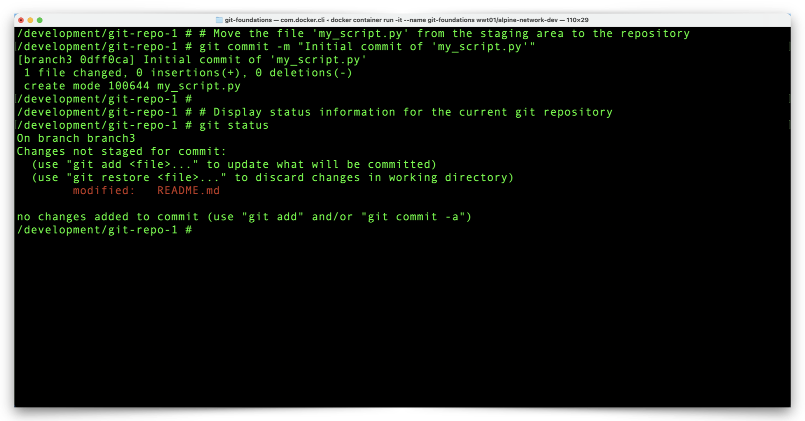
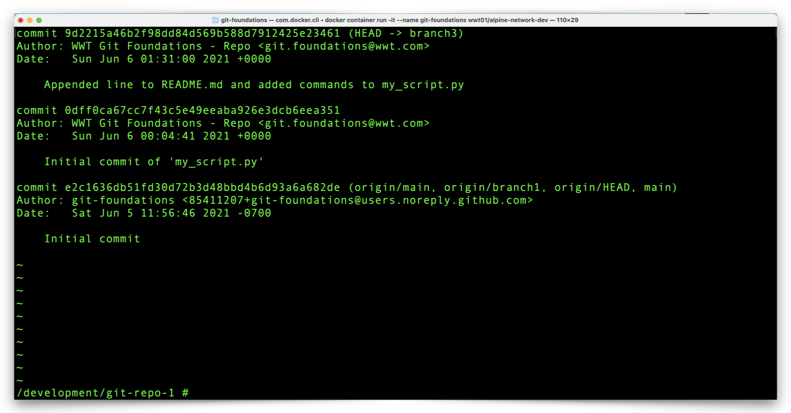
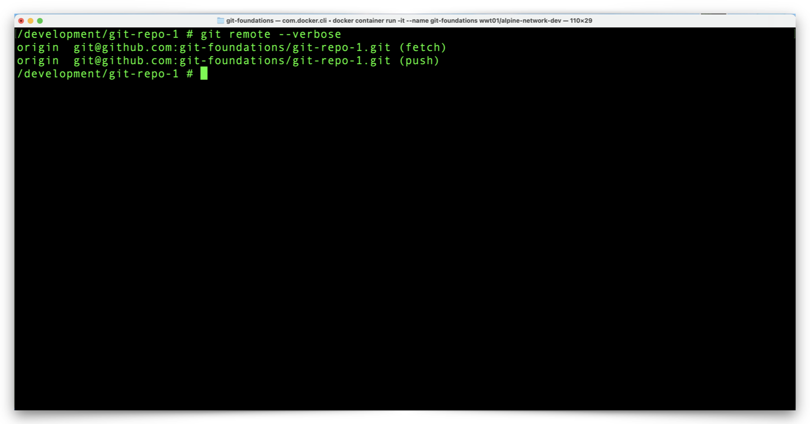

# Make Local Git Repository Changes With Atomic Commits

It is possible to commit many changes to a single file at once although doing so can make it difficult to find and roll-back individual changes within a commit. Alternatively, _atomic commits_ are those which involve a separate commit for each change to a file. While atomic commits can be more tedious, they provide the benefit of isolating individual changes to individual commits.

---

## Create and Commit a New Python Script to the Repository

1. Let's create a new file, a simple Python script, in our repository. The file will be blank to start, but we will add some code to the file shortly. In the next series of commands we will:
   - Create a Python script.
   - List the contents of the repository directory.
   - Review the Git repository status.

```shell
# Create a new, blank file named 'my_script.py'
touch my_script.py
```

```shell
# List the contents of the current directory in long format
ls -l
```

```shell
# Display status information for the current git repository
git status
```


2. Notice the following:

   - The **my_script.py** file exists and is empty (0 bytes).
   - The **my_script.py** file is in the `Untracked files` section of the `git status` output.

:bulb: **Note: An _untracked file_ is a file which the local Git repository has not seen before.**

---

3. Issue commands to:
   - Add the **my_script.py** file to the Git staging area.
   - Review the status of the Git repository.

```shell
# Move the 'my_script.py' file from the working directory to the staging area
git add my_script.py
```

```shell
# Display status information for the current git repository
git status
```


4. Notice that the **my_script.py** file is now in the `Changes to be committed` section.
   - This indicates **my_script.py** is in the Git **staging area**.

---

5. Issue commands to:
   - Commit the **my_script.py** file to the local Git repository with the `git commit` command, followed by the `-m` option and a message about the commit details.
     - The `-m` command option prefixes the **required message** that accompanies a commit to a Git repository.
     - There are other ways to add a message to a commit, although the `-m` option is, generally, the simplest.
   - Review the status of the local Git repository.

```
!!! note
    :warning: Commits to a Git repository require a commit message and the message should describe changes adequately enough that someone else can understand the overall theme or intent of the changes.
```

:exclamation: **The `-m` option after the `git commit` command allows you to enter a commit message inline.  If you omit the `-m` option, Git will open the default text editor for the OS (VIM is the default editor for most Linux distributions) and prompt for a commit message.**

:bangbang: **If you happen to end up in the Docker Container VIM editor, press the `esc`key, type `:q!`, and press `Return` or `Enter`.** 

```shell
# Move the file 'my_script.py' from the staging area to the repository
git commit -m "Initial commit of 'my_script.py'"
```

```shell
# Display status information for the current git repository
git status
```



6. Notice there are no changes to commit. The **README.md** file does have changes although isn't yet staged for commit, we will work on that shortly.

---

## Add Python Code to the my_script.py File

1. To make changes to the **my_script.py** file, we will add some executable Python code. Use the following commands to add some executable Python code to **my_script.py**:

```shell
# Python code which collects a name and displays a greeting
echo '#!/usr/bin/env python' >> my_script.py
echo '# This script displays a greeting' >> my_script.py
echo 'name = input("What is your name? ")' >> my_script.py
echo 'print(f"It is nice to meet you, {name})' >> my_script.py
```


---

2. View the changes between the copy of **my_script.py** file in the working directory and the copy in the local Git repository with the following command:

```shell
# Display changes between the working and committed files within the git repository
git diff
```


3. Notice the `+` characters next to the last four lines in the `git diff` output.  This indicates four lines of changes between the **my_script.py** file in the working directory and the copy of **my_script.py** which is already in (committed to) the local Git repository.

---

4. View the status of your local Git repository with the following command:

```shell
# Display status information for the current git repository
git status
```


---

5. We now have two changed files to stage and then commit to the local repository. Issue commands to:
   - Move all changed files in the working directory to the staging area.
   - Review the repository status.
   - Commit the staged changes to the repository.

```shell
# Move all changed files from the working directory to the staging area
git add .
```

```
!!! note
    :bulb: You may also commit individual files to the staging area.  For example, to stage only the README.md file, use the command `git add README.md`.
```

```shell
# Display status information for the current git repository
git status
```

```shell
# Commit all staged files to the repository with a descriptive comment
git commit -m "Appended line to README.md and added commands to my_script.py"
```


6. Notice the output from the `git status` command shows two files in the staging area, in the `Changes to be committed` section of the output.
7. Also notice the output from the `git commit` command shows `two files changed` and a combined `5 insertions` (new lines of text).

---

7. View the status of your local Git repository with the following command:

```shell
# Display status information for the current git repository
git status
```


8. Notice the working branch, **branch3** shows no changes to commit.

---

9. Sometimes it is necessary to roll-back to a previous repository commit or to understand the history of changes to a repository (who did what to which files).  You can review the complete commit history for a repository with the `git log` command.

```shell
# Display the logged git history for the repository
git log
```



10. Notice how information about the most recent commit is at the top of the `git log` output, and how the **commit messages** for each commit in the log provide important information about the changes a particular commit includes.  This is one reason descriptive commit messages are important.

---

## Push Committed Changes to GitHub

1. We now have several atomic commits in our local repository which we can now push to our GitHub repository. The `git push` command will synchronize the local Git repository changes with the GitHub repository.

```
!!! note
    :bulb: To determine which remote repository a `git push` will send changes to, use either of the commands `git remote --verbose`, `git remote -v`, or `cat .git/config` .
```

```shell
# Determine the remote repository URL
git remote --verbose
```



---

2. Attempt to push local Git repository changes to GitHub with the following command:

```shell
# Push local repository changes to a remote repository
git push
```


3. Notice that we receive a `fatal` error message when we attempt to use the `git push` command. GitHub does not have a branch which matches the working branch in our local repository (**branch3**) and, therefore, returns an error.
   - Before we can push changes with a simple `git push` command, we need to create **branch3** in GitHub.
   - Notice in the output, after the `fatal` error, Git is friendly enough to display the exact command to both create **branch3** in GitHub and then push our commits to GitHub.

---

4. Initiate the `git push` again with the following command:

```shell
# Push local repository changes, including the local branch, to a remote repository
git push --set-upstream origin branch3
```


5. Notice that Git creates a new branch, **branch3**, in GitHub, and pushes the local Git repository **branch3** commits to the new GitHub **branch3**.

Next we will take a look at our GitHub repository to review the changes we pushed from our local Git repository. Click the link below to continue:

[Next Section > Review Changes in the GitHub Repository](section_10.md "Review Changes in the GitHub Repository")
