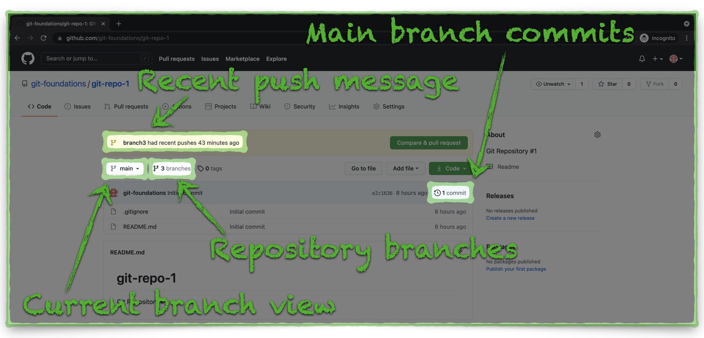
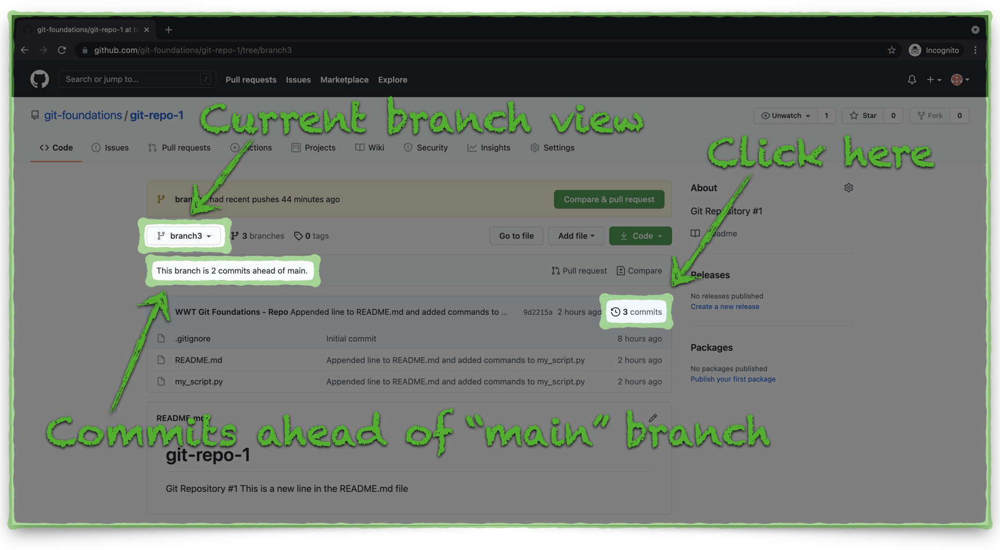

# Review Changes in the GitHub Repository

Let's take a look at how the changes we pushed from our local repository impact the GitHub repository.

**Local Repository Push Review**

1. Return to GitHub and notice some a few things about the repository:
   - There is still just one commit on the **master** branch; we haven't yet merged the changes we pushed from **branch3**.
   - There are now three branches, up from two before we pushed **branch3** from our local repository to GitHub.
   - There is a highlighted message indicating a recently pushed branch (**branch3**).

2. Expand the **Branch: master** drop menu and notice there three branches, **master**, **branch1**, and **branch3**.
3. Click on **branch3**:

4. From the **branch3** view, notice GitHub shows us that **branch3** is two commits ahead of the **master** branch.
   - These two commits represent the two commits we made to our local repository and pushed to GitHub.
5. Click on the **3 commits** link to review the individual commits.

5. The **branch3** commits view shows three total commits.
   - One of the commits is the initial commit that occured when we created the repository.
   - We can also see the two atomic commits from our local Git repository along with the comments we added with the **git commit -m** commands.
   - Even though the **git push** command sent all of our local repository to GitHub at once, the individual atomic commits remain separate and reviewable.

Now we can start the process to merge our local changes to the repository, from **branch3**, into the **master** branch.  Click the link below to continue:

[Next Section > Pull/Merge Changes in GitHub](section_11.md "Pull/Merge Changes in GitHub")

