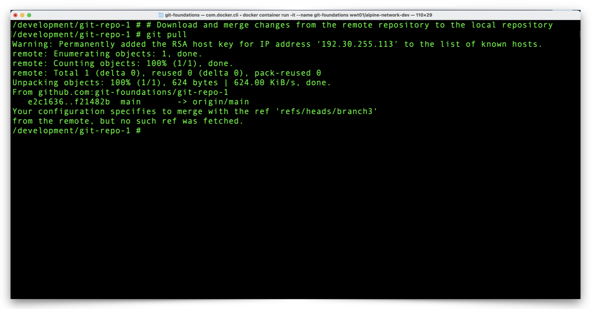
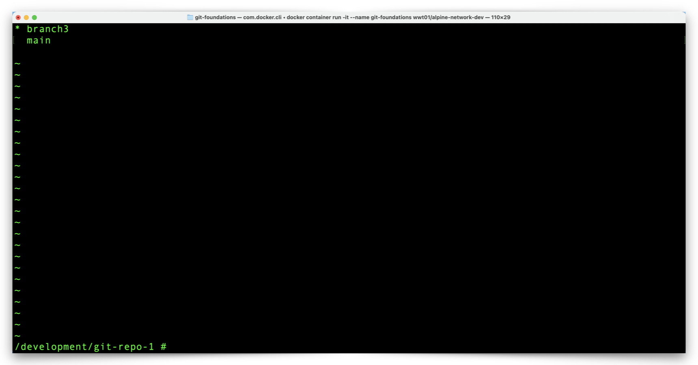
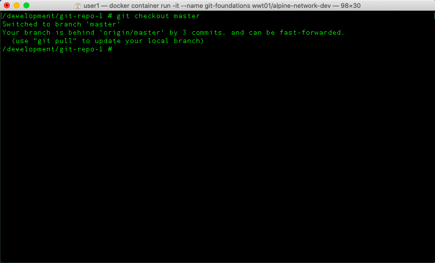
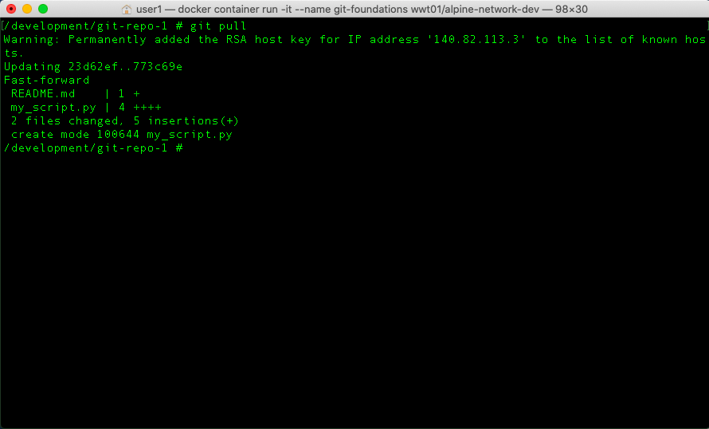
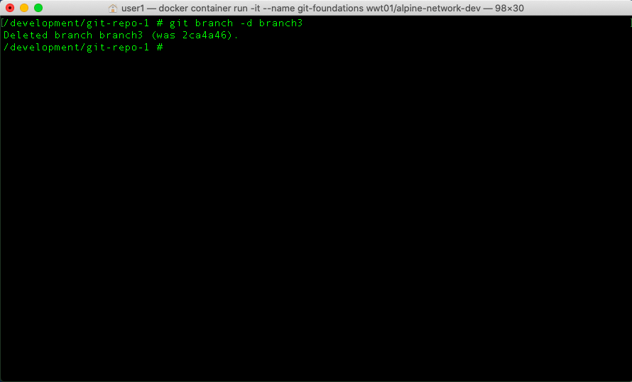
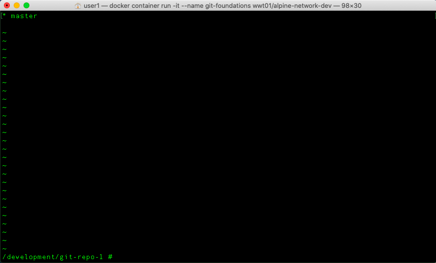

# Review The Pull Request Impact to Your Local Git Repository

The GitHub repository has a new version of the **master** branch but our local repository isn't aware of the change yet.  Before we make new changes to our local repository, let's get it back in sync with GitHub and clean up the branch (**branch3**) which is no longer in GitHub.


**Pull Changes from GitHub**

1. From your terminal, pull the latest changes from GitHub to your local repository with the following command:

```shell
git pull
```




2. Notice the last two lines of the output which indicate Git attempted to pull changes from GitHub and merge those changes with **branch3** in the local repository.
   - However, Git was unable to locate **branch3** in GitHub because, of course, we deleted **branch3** in GitHub after merging our **pull request**.

3. List your local branches with the following command:

```shell
git branch
```




4. Notice **branch3** remains in your local repository.
5. Change your working branch to **master** with the following command:

```shell
git checkout master
```




6. Notice the message which indicates the local branch **master** is behind the GitHub **master** branch (**origin/master**) by three commits and can be fast-forwarded.

7. Merge the GitHub **master** branch with your local repository **master** branch using the following command:

```shell
git pull
```




8. Notice the output which indicates the file changes and insertions.
9. Since our local **master** branch now in sync with the latest copy of the GitHub repository, we no longer need our local copy of **branch3**.  Remove **branch3** from the local repository with the following command:

```shell
git branch -d branch3
```




10. Confirm **branch3** no longer exists with the following command:

```shell
git branch
```




11. Notice that **master** is now the only branch in your local repository.


You did it!  You:

- Setup a new GitHub repository.
- Setup a local Git enviornment in a Docker Container.
- Managed Git branches.
- Staged and committed local repository changes.
- Pushed branches and changes from your local Git environment to GitHub.
- Merged changes in GitHub with a pull request.
- Synchronized merged GitHub changes to your local Git environment.


Click the link below to go to the last section and finish things up:

[Next Section > Clone Another Repository, Make Changes, and Create a New Pull Request](section_13.md "Clone Another Repository, Make Changes, and Create a New Pull Request")

