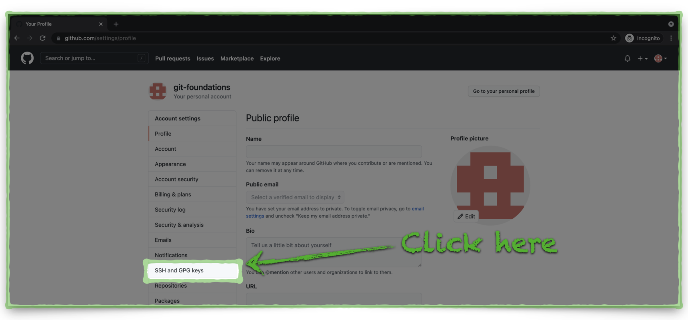
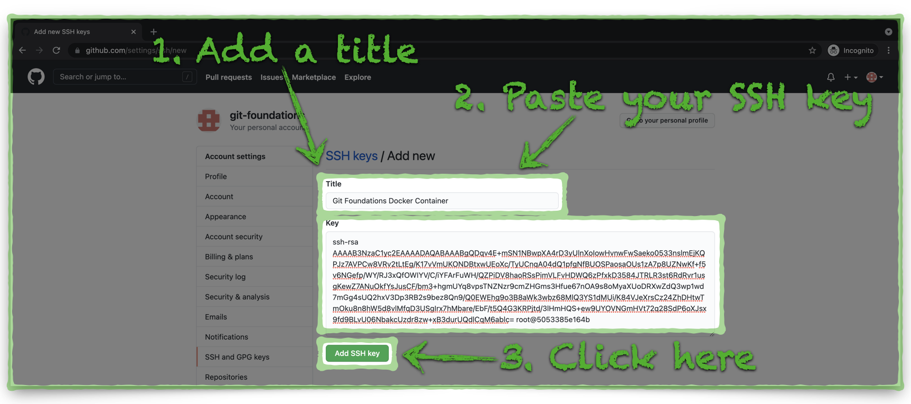

# Setup GitHub Authentication

Before we setup the GitHub repository, it's a good idea to consider how our local environment will authenticate to GitHub during synchronization.  GitHub supports two types of secure transport, each with their own authentication mechanism(s):

1. HTTPS with basic authentication (username and password) or API key
2. SSH with public/private key authentication

Either choice is just as good as the other.  In this environment we use SSH because it allows us to secure communication without having manage credentials or API keys.  We will setup SSH authentication before we create a GitHub repository.


**Generate an SSH Key Pair**

1. From the Docker Container prompt generate an SSH key pair with the following command.

```shell
ssh-keygen
```

   

2. Press your Return/Enter key to accept the default location for the key and to accept and confirm the default, blank passphrase.  Your terminal output will look something like this:


   

3. Print the new SSH public key file to the terminal with this command:

```shell
cat ~/.ssh/id_rsa.pub
```


4. Copy the full contents of the file to your clipboard including the **ssh-rsa** at the beginning of the file and the **root@container_id** at the end of the file.  We will share the text from this file with GitHub to establish mutual trust between our container and GitHub.


**Setup GitHub SSH Key Authentication**

1. Navigate to [https://github.com/login](https://github.com/login), log in, click the **Profile** icon in the upper-right corner of the window, and choose **Settings**.


2. Click on the **SSH and GPG keys** tab on the left side of the window.




3. Click the green, **New SSH key** button


4. Provide a title for the SSH key, paste the SSH key file text from your container into the **Key** field, and click the green, **Add SSH key** button.




5. Confirm that GitHub now has a copy of your container's SSH public key.


SSH authentication setup is complete and we are ready to create a new GitHub repository.  Click the link below to continue:

[Next Section > Setup a GitHub Repository](section_3.md "Setup a GitHub Repository")

