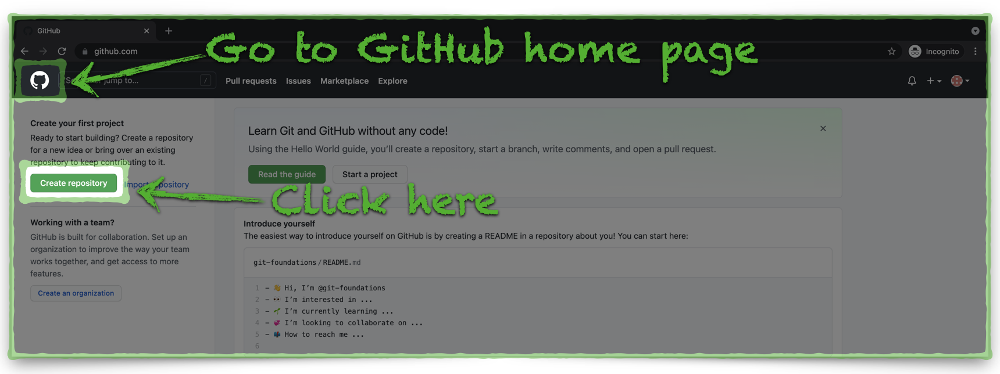
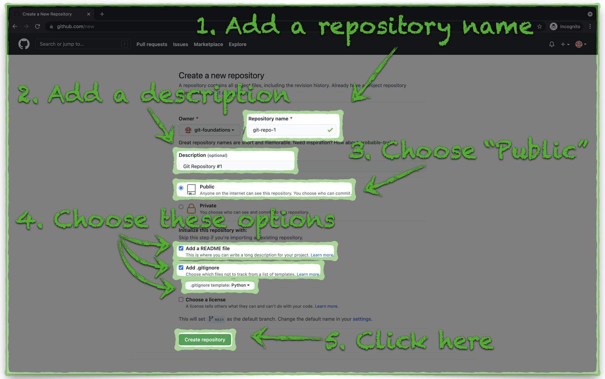
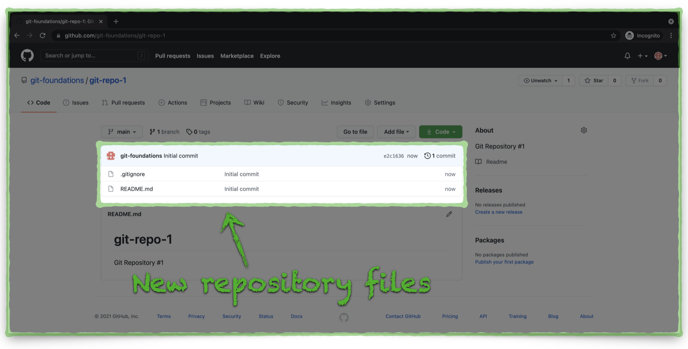

# Create a GitHub Repository

You have the option to create Git repositories either on your local machine (within a Docker Container in our case) or on a remote Git environment; it's a mater of personal preference. In either case, you can keep the Git repositories in sync. In this example we will create a Git repository on GitHub and then, later, clone the repository to our local environment.

## **Create a new GitHub Repository**

1. Navigate to [https://github.com/login](https://github.com/login) and log in
2. The view you see may vary depending on whether your GitHub account is new. You should see a green button on the left side of the window which reads either **Create repository**, **New repository**, or something similar.
   - If you don't see the button, navigate to your GitHub home page with click to the GitHub logo in the upper-left corner of any GitHub window.

---

3. You need to enter some information and choose some options to create the repository.
   - **Name** — **_git-repo-1_**
   - **Description** — **_Git Repository \#1_**
   - Set your repository to **Public**
   - Tick the box to **Initialize this repository with a README**
     - Note — the **Name** and **Description** values provide the initial title and contents for the repository README file.
   - Expand the **Add .gitignore** dropdown and type or choose **Python**
   - Click the **Create repository** button

---

4. Take a look at your new repository! You have two files, **.gitignore** and **README.md**.

Our new repository is ready for use. We will briefly look at GitHub branches before next. Click the link below to continue:

[Next Section > Create a New Branch in a GitHub Repository](section_4.md "Create a New Branch in a GitHub Repository")
