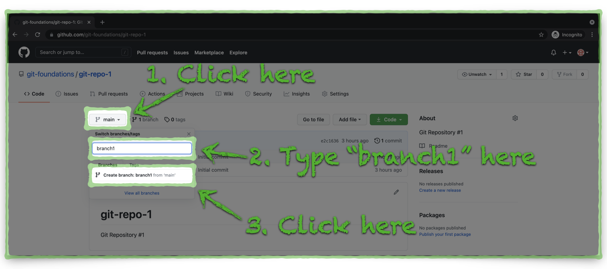

# Create a New Branch in a GitHub Repository

1. 

2. 

Log on to https://github.wwt.com (ATC VPN required)
Open your Git repository
From the home screen, your repository list is on the left
Click the 'Branch: master' button
Type the name for your new branch (Branch1) and click the 'Create branch' button
Notice you now have two branches; 'master' and your new branch

[Next Section > Clone a GitHub Repository to Your Computer](section_5.md "Clone a GitHub Repository to Your Computer")

