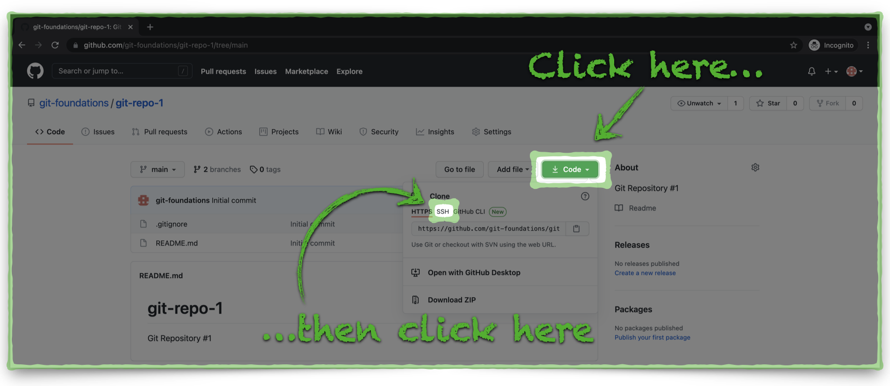
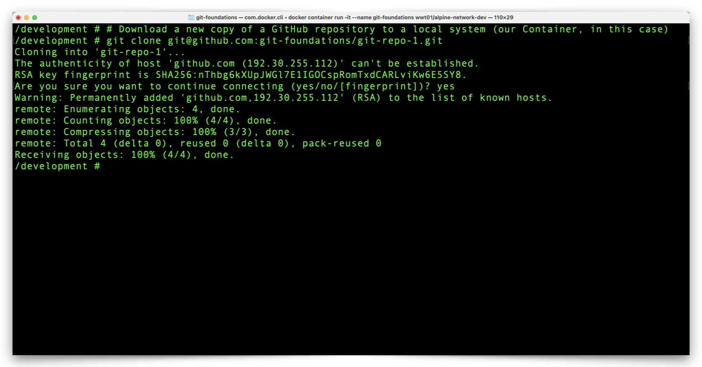
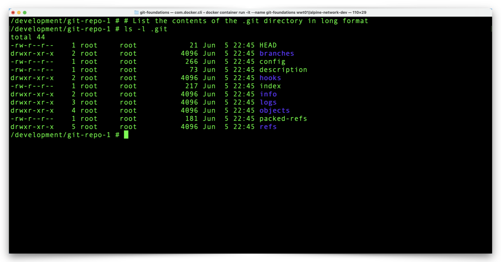

# Clone a GitHub Repository to Your Computer

Now it's time for us to work with our GitHub repository and we start by copying or **cloning** the repository to our Docker environment.  


**Copy The Repository SSH URL**

We mentioned GitHub supports two transports, HTTPS and SSH.  GitHub defaults to HTTPS transport which adds an extra step to the cloning process.

1. Click the green **Clone or download button** and notice that GitHub displays an HTTPS URL.  Click the **Use SSH** link to change the display to an SSH URL.




2. Click the **Copy** icon, just to the right of the SSH URL, to store the URL on your clipboard.


**Clone & Review The Repository**

1. From the Docker Container prompt, type the command **git clone** and then paste ***your repository URL*** as in this ***example*** (your repository URL will be different):


```shell
git clone git@github.com:your-repository-url/git-repo-1.git
```


**Note - you may see a prompt which asks you to confirm the authenticity of GitHub's SSH RSA fingerprint.  You may safely continue.**

The result of that command should look something like this:




2. List your directory contents to view your repository folder, **git-repo-1**, with the following command:

```shell
ls -l
```


3. Change to your repository directory with the following command:

```shell
cd git-repo-1
```


4. Let's take a quick look at the contents of your repository directory, including the hidden files with the following command.

```shell
ls -la
```


5. Notice that both of the files in your GitHub repository (**.gitignore** and **README.md**) are now in our Docker container.  View the contents of the **README.md** file with the following command:

```shell
cat README.md
```


6. There is one item in our repository directory which isn't in our GitHub repository, the **.git** directory.  This directory contains all of the details about your local repository and, for the most part, you should not have to interact with these files.  Just to see what the contents of this folder look like, use the follwoing command:

```shell
ls -l .git
```




We now have a copy of our GitHub repo in our Docker environment.  Before we make changes to our local copy of the repository, we need to configure a few local Git settings.  Click the link below to continue:

[Next Section > View & Configure Local Git Settings](section_6.md "View & Configure Local Git Settings")

