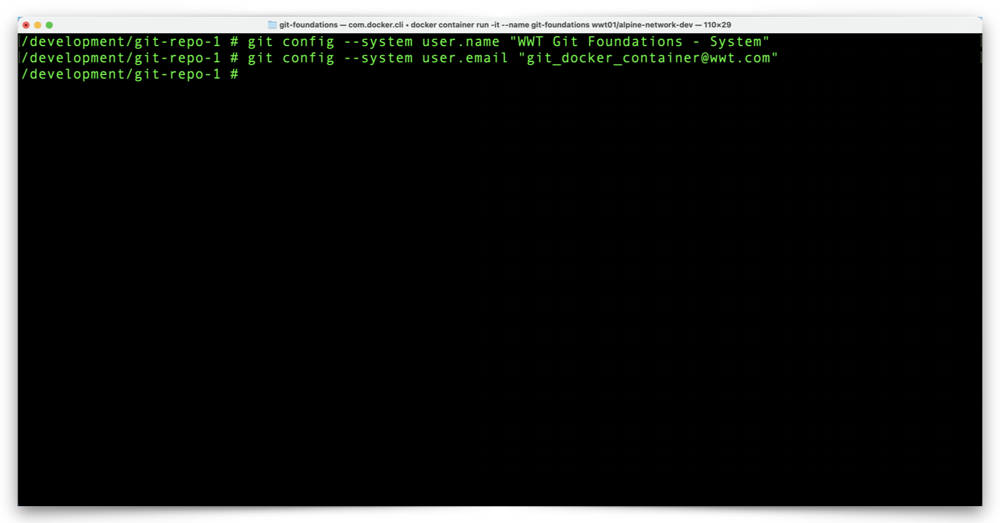
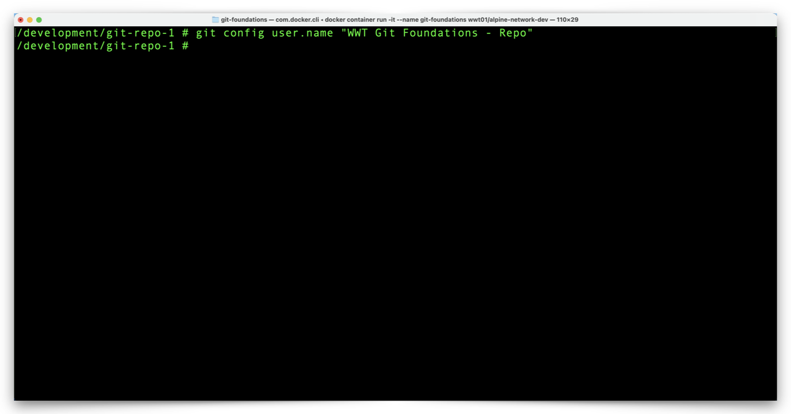
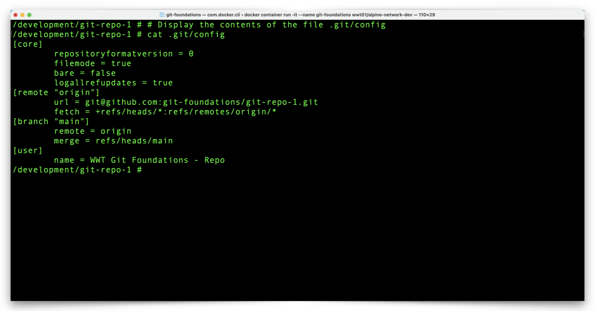
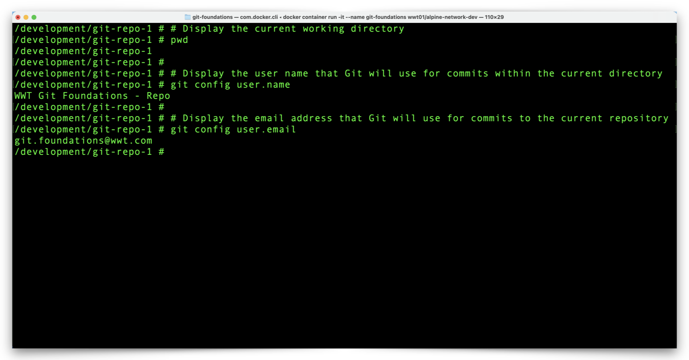

# View & Configure Local Git Settings

Git requires very little information before we can start to make local repository changes and then push those changes to GitHub.  We just need to tell Git the **name** and **email address** of the person contributing changes, as a way to help all repository viewers and contributors understand who contributes what.  We provide Git our **name** and **email address** in one or more configuration files.

Git has several tiers of configuration files and we will explore the three most common:

- **System-wide** - ***/etc/gitconfig***
  - Applies to all repositories for *all* users on a system.
- **Global** - ***~/.gitconfig***
  - Applies to all repositories for a *single* user on a system.
  - Supersedes any overlapping **system-wide** settings.
- **Local repository** - ***repository_folder/.git/config***
  - Applies to a single repository.
  - Supercedes any overlapping **global** and **system-wide** settings.


**Git Name & Email Address Configuration**

It is most typical for people to add their **name** and **email address** to their **global** configuration settings, thereby making it possible to perform Git operations on any repository within their user profile.  If a few Git repositories within a user profile require a different **name** or **email address** combination, it is typical to set those at the **local repository** level, on a case-by-case basis.

For the purpose of familiarization with the process to configure different Git configuration files, we will configure our Docker environment in a non-typical although functional way.


**Edit Git Configuration Files**

1. From your Docker container prompt, configure a **system-wide** Git **username** and **email address** with the following commands:


```shell
git config --system user.name "Your Name - System"
# Replace 'Your Name' with your first/last name

git config --system user.email "git_docker_container@wwt.com"
# Do not replace this email address
```




2. Review the **system-wide** configuration file with the following command:

```shell
cat /etc/gitconfig
```


3. Notice the **name** and **email** values are part of the Git **system** configuration file.  Right now, these settings apply to all Git repositories for all users in our enviornment.
   - Typically, you would simply enter your name without the **- System** suffix.  The suffix will allow us to distinguish which configuration settings take precedence later on, for the purpose of learning.

4. Configure a **Global** Git **username** and **email address** with the following commands:

```shell
git config --global user.name "Your Name - Global"
# Replace 'Your Name' with your first/last name

git config --global user.email "your.email@your_domain.com"
# Replace 'your.email@your_domain.com' with your email address
```


5. Review the **global** configuration file with the following command:

```shell
cat ~/.gitconfig
```


6. Notice the **name** and **email** values are part of the Git **global** configuration file.  Right now, these settings apply to all Git repositories for our current user profile.  Effectively, this is all of the repositories in our Docker environment which means the Git **system** configuration settings no longer apply.
   - Again, you would normally enter your name without the **- Global** suffix.

7. To configure values for a **local repository**, make sure your working directory is that of the repository you want to configure.  Configure the **local repository** Git **username** with the following command:

```shell
git config user.name "Your Name - Repo"
# Replace 'Your Name' with your first/last name
```



 

8. Review the **local** configuration file for the **git-repo-1** repository with the following command:

```shell
cat .git/config
```




9. Notice there is a **name** value but no **email** value in the **local repository** configuration file.


**Review Effective Git Configuration Settings**

1. Since we set Git configuration values in three separate places, we need to determine which values Git will use.  To do that enter the following commands:

```shell
git config user.name
git config email.address
```




2. We set a **user.name** value within the **local repository** and Git returns that value (notice the name suffix).  Since we didn't set a local repository email, Git looks to the next higher level configuration file, the **global** Git configuration file, for an email address and displays that address.

3. If we change our working directory such that we are no longer within this repository, we can see the difference in the effective Git configuration for repositories without specific configurations.  Use the following commands to navigate to a different directory and check Git configuration settings:

```shell
cd ..
git config user.name
git config user.email
```


4. Outside of our repository we see the both the **user.name** and **user.email** values come from the **global** configuration file (notice the name suffix).
5. Change the working directory back to our local repository before we continue with the following command:


We have all of the Git configuration settings in place to start working with our Git repository.  Click the link below to continue:

[Next Section > Manage Local Git Branches](section_7.md "Manage Local Git Branches")

