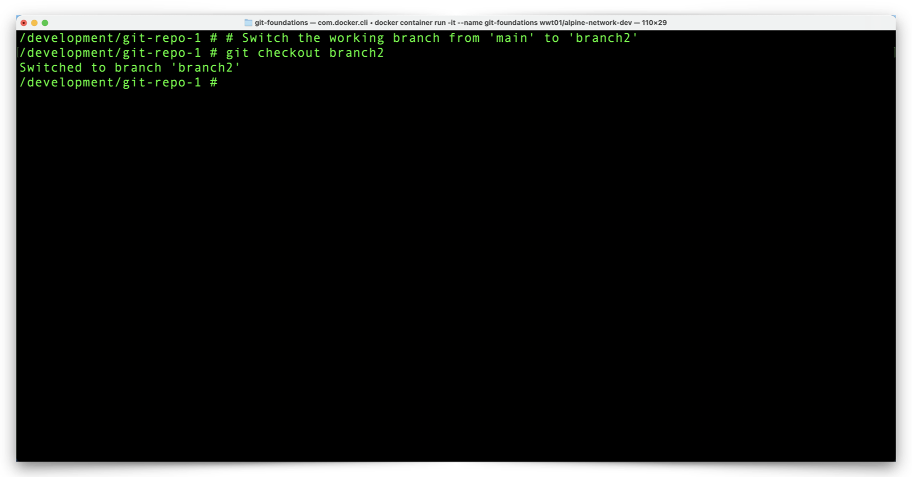

# Manage Local Git Branches

Our Git environment is ready for us to start work on our repository. Typically, especially on a project with many contributors, Git branches allow each contributor to have as many non-overlapping copies of the repository as they need to make and manage their changes. We will do some basic work with branches, so we can, later, contribute our changes to the master branch of the GitHub repository.

## **View, Create, Switch To & Remove Branches**

1. From the Docker Container prompt, list your _local_ branches with the following command:

```shell
git branch
```


2. Notice that only the **master** branch cloned to your local repository from GitHub.

   - This is normal/correct behavior; only the **master** branch clones from GitHub because other branches (like the **branch1** branch we created in GitHub) are likely other peoples' work in-progress and any work we do should originate from the master copy of the repository.
   - The asterisk to the left of **master** indicates that **master** is our current, working branch.

3. List all repository branches, local _and_ remote, with the following command:

```shell
git branch -a
```


4. Notice how we see a **master** branch plus an **origin/master** branch.

   - **Origin** is how our local repository refers to GitHub so **origin/master** represents the **master** branch on GitHub.

5. Create a new, local branch named **branch2**, with the following command:

```shell
git branch branch2
```


6. List your local branches again with the following command:

```shell
git branch
```


7. Notice your new branch, **branch2** and also that the asterisk next to **master** tells us that, even though we just created **branch2**, our working branch is still **master**.
8. Again, list all branches, local and remote, with the following command:

```shell
git branch -a
```


9. Notice that **branch2** does not exist as a remote branch in GitHub. This is normal behavior and something we will work with later on.

10. Switch your working branch to **branch2** with the following command:

```shell
git checkout branch2
```



11. Verify your current, working branch with the following command:

```shell
git branch
```


12. Notice the asterisk next to **branch2** to indicate that **branch2** is our current, working branch.
13. Create and simultaneously switch to a new branch with the following command:

```shell
git checkout -b branch3
```


14. The **git checkout** command allows you to switch between branches and the **-b** flag creates a new branch _and_ switches to the new branch. This is just a shortcut for **git branch _branch_name_** followed by **git checkout _branch_name_**.
15. List your local branches again with the following command:

```shell
git branch
```


16. Notice the asterisk next to **branch3** to indicate that **branch3** is our current, working branch.

17. For our purpose we only need one branch, in addition to the **master** branch, so we can remove one of our new branches with the following command:

```shell
git branch -d branch2
```


18. Review your branches with the following command:

```shell
git branch
```


19. Notice that **branch2** is no longer available.

We can make some changes to our repository within **branch3** without impacting the **master** branch. Click the link below to continue:

[Next Section > Make Local Git Repository Changes](section_8.md "Make Local Git Repository Changes")
