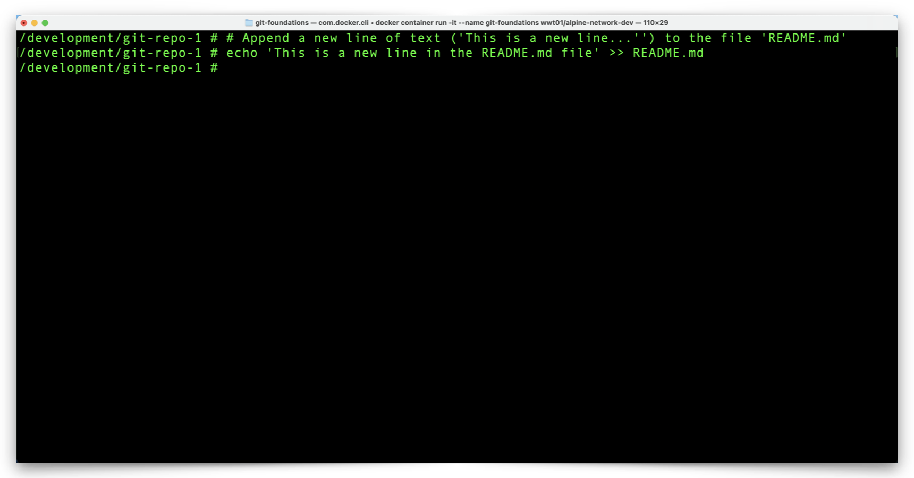
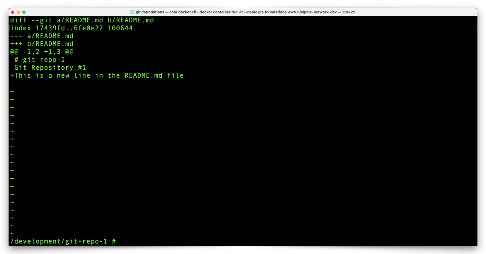
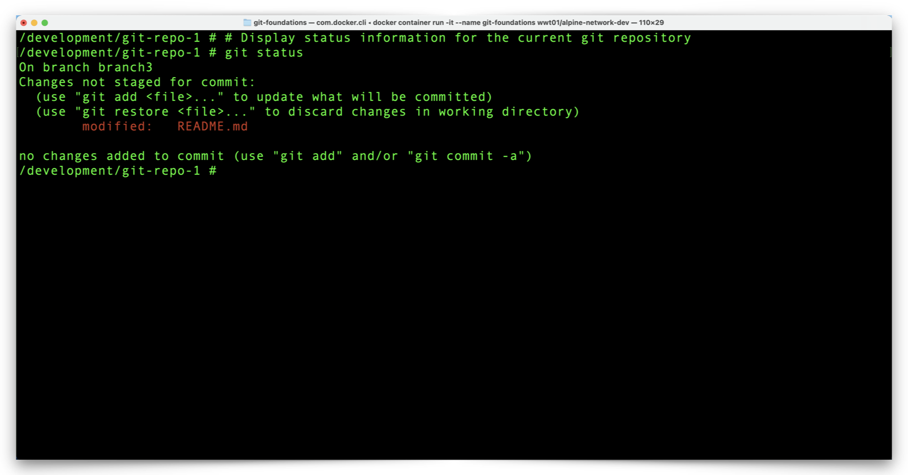

# Make Local Git Repository Changes

Let's make a change to one of the files in our local repository and see how Git reacts to that change.

## **Append the README.md File**

1. From the Docker Container prompt, view the Git status of your local repository with the following command:

```shell
git status
```


2. Notice your working branch, **branch3** and that you have no changes to commit.
3. Write a new line to the **README.md** file with the following command:

```shell
echo 'This is a new line in the README.md file' >> README.md
```



4. View the changes between the copy of **README.md** in the working directory and the local repository with the following command:

```shell
git diff
```



5. View the Git status of your local repository with the following command:

```shell
git status
```



6. Notice the **README.md** file in the section, **Changes not staged for commit**.

We made a change to one of the files in our working directory and next up is the process to move files from the working directory, to the staging area, and to the local repository (HEAD). Click the link below to continue:

[Next Section > Make Local Git Repository Changes With Atomic Commits](section_9.md "SMake Local Git Repository Changes With Atomic Commits")
