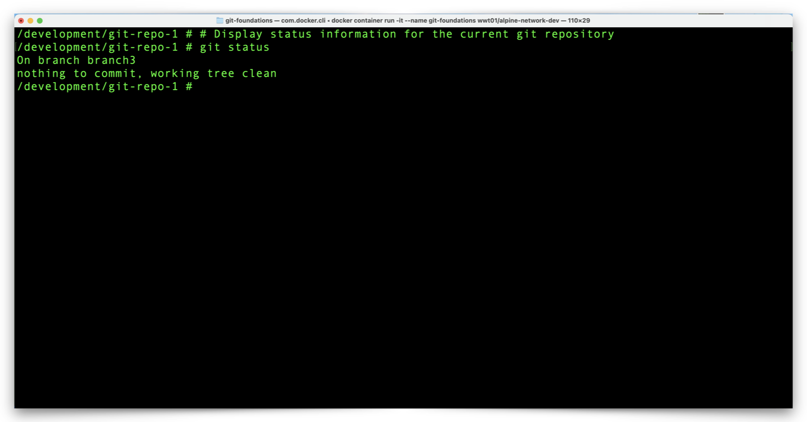
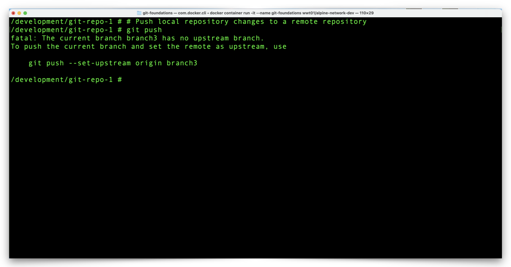

# Make Local Git Repository Changes With Atomic Commits

It is possible to commit many changes to a single file at once although doing so can make it difficult to find and roll back individual changes within a commit. Alternatively, atomic commits are those which involve a separate commit for each change to a file. While atomic commits can be more tedious, they provide the benefit of isolating individual changes to individual commits.

## **Create and Commit a New Python Script to the Repository**

1. Let's create a new file, a simple Python script, in our repository. The file will be blank to start, but we will add some code to the file shortly. In one series of commands we will:
   - Create a Python script.
   - List the contents of the repository
   - Review the Git repository status.

```shell
# Create a new, blank file named 'my_script.py'
touch my_script.py
```

```shell
# List the contents of the current directory in long format
ls -l
```

```shell
# Display status information for the current git repository
git status
```


2. Notice the following:

   - The **my_script.py** file exists and is empty (0 bytes).
   - The **my_script.py** file is in the **Untracked files** section of the **git status** output.

---

3. Issue commands to:
   - Add the **my_script.py** file to the Git staging area.
   - Review the Git repository status.

```shell
# Move the 'my_script.py' file from the working directory to the staging area
git add my_script.py
```

```shell
# Display status information for the current git repository
git status
```


4. Notice that the **my_script.py** is now in the **Changes to be committed** section.
   - This indicates **my_script.py** is now in the Git staging area.

---

5. Issue commands to:
   - Commit the **my_script.py** file to the local Git repository.
     - The **-m** flag represents the required message that accompanies the commit.
     - There are other ways to add a message to a commit, although a message is required for each commit.
   - Review the Git repository status.

```shell
# Move the file 'my_script.py' from the staging area to the repository
git commit -m "Initial commit of 'my_script.py'"
```


6. Notice there are no changes to commit. The **README.md** file does have changes although isn't yet staged for commit; we will work on that shortly.

## **Add Python Code to the my_script.py File**

1. To make changes to the **my_script.py** file, we will add some executable code. Use the following commands to add some executable Python code to **my_script.py**:

```shell
# Python code which collects a name and displays a greeting
echo '#!/usr/bin/env python' >> my_script.py
echo '# This script displays a greeting' >> my_script.py
echo 'name = input("What is your name? ")' >> my_script.py
echo 'print(f"It is nice to meet you, {name})' >> my_script.py
```


---

2. View the changes between the copy of **my_script.py** in the working directory and the local repository with the following command:

```shell
# Display changes between the working and committed files within the current git repository
git diff
```


3. Notice the ... //Screenshot and comments

---

4. View the Git status of your local repository with the following command:

```shell
# Display status information for the current git repository
git status
```


4. We now have two changed files to stage and commit to the local repository. Issue commands to:
   - Move all changed files in the working directory to the staging area.
   - Commit the staged changes to the repository.

```shell
# Move all changed files from the working directory to the staging area
git add .
```

:bulb: **Note: You may also commit individual files to the staging area.  For example, to stage only the README.md file, use the command `git add README.md`. **

```shell
# Commit all staged files to the repository with a descriptive comment
git commit -m "Appended line to README.md and added commands to my_script.py"
```

:bulb: **Note: Commits to a Git repository require a commit message and the message should describe changes adequately enough that someone else can understand the overall theme or intent of the changes.**

:exclamation: **The `-m` option after the `git commit` command allows you to enter a commit message inline.  If you omit the `-m` option, Git will open the default text editor for the OS (VIM for most Linux distributions) and prompt for a commit message.**


---

5. View the Git status of your local repository with the following command:

```shell
# Display status information for the current git repository
git status
```



6. Notice the working branch, **branch3** shows no changes to commit.

## **Push Committed Changes to GitHub**

1. We now have several atomic commits in our local repository that we can push to our GitHub repository. This will synchronize the local Git repository changes with the GitHub repository.  Initiate the push with the following command:

:bulb: **Note: To determine which remote repository a `git push` will send changes to, use either of the commands `git remote --verbose` or `git remote -v` .**

```shell
# Determine the remote repository URL
git remote --verbose
```

```shell
# Push local repository changes to a remote repository
git push
```



---

2. Notice that we receive a **fatal** error when we attempt the `git push` - GitHub does not have a branch which matches the working branch in our local repository (**branch3**).
   - Before we can push changes with a simple `git push` command, we need to create **branch3** in GitHub.
   - Notice in the output, after the **fatal** error, Git is friendly enough to display the exact command to both create **branch3** in GitHub and then push our atomic commits to GitHub.
   - Initiate the push again with the following command:

```shell
# Push local repository changes, including the local branch, to a remote repository
git push --set-upstream origin branch3
```


3. Notice that Git creates a new branch, **branch3**, in GitHub, and pushes the local repository **branch3** commits to the GitHub **branch3**.

Next we will take a look at our GitHub repository to review the changes we pushed from our local repository. Click the link below to continue:

[Next Section > Review Changes in the GitHub Repository](section_10.md "Review Changes in the GitHub Repository")
